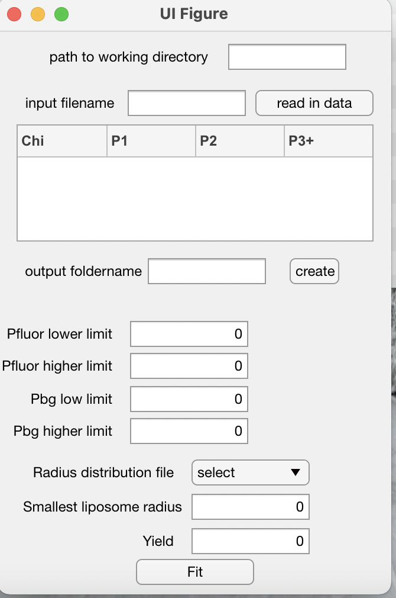
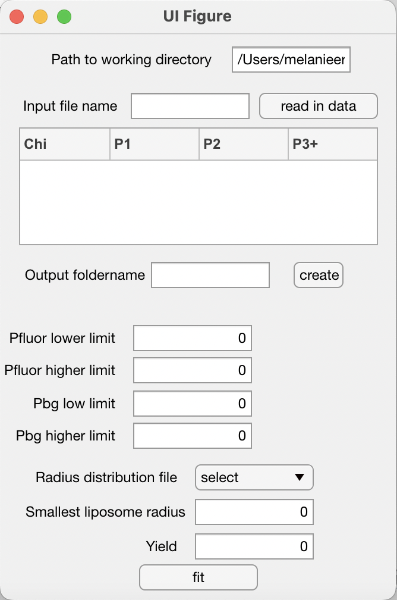
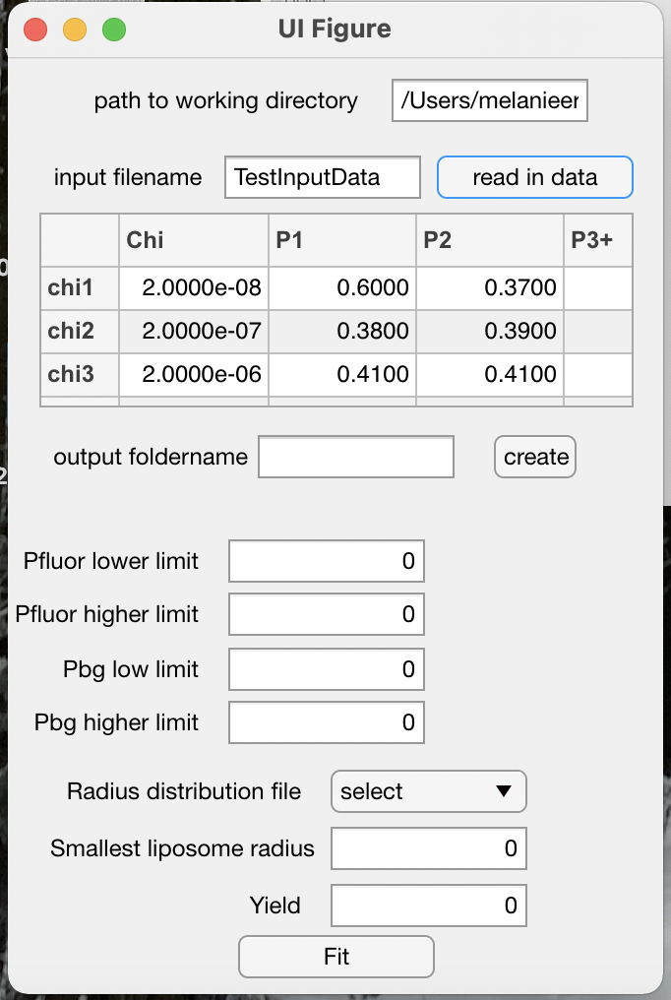
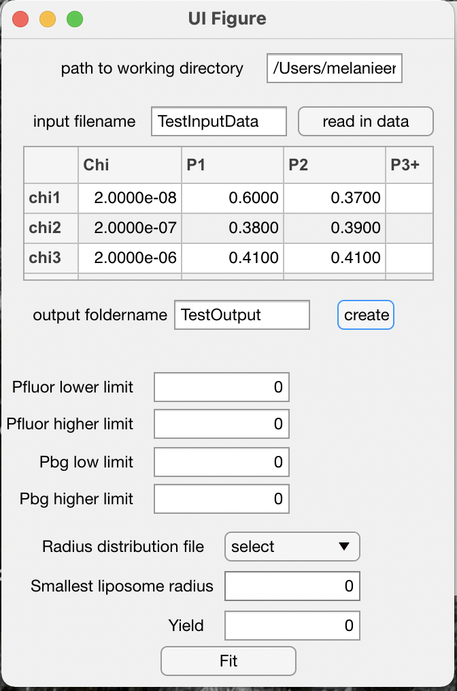
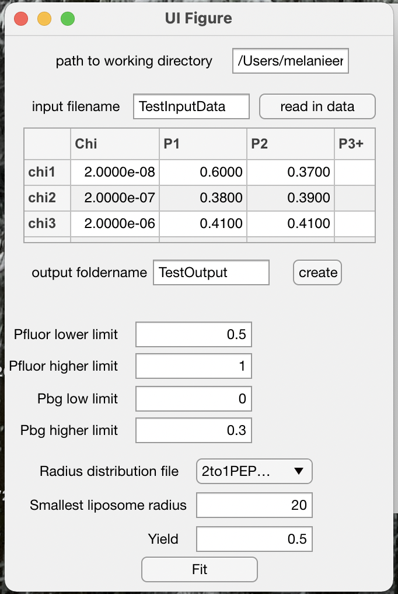
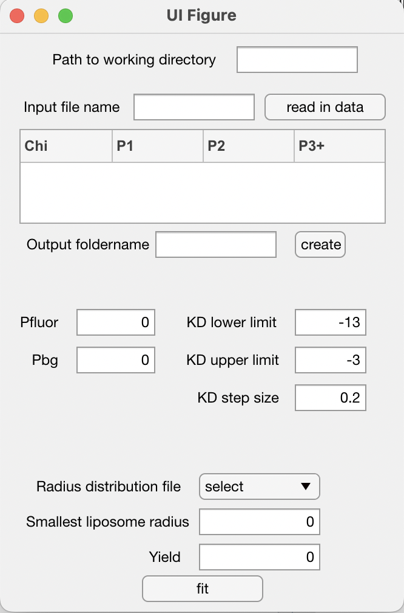
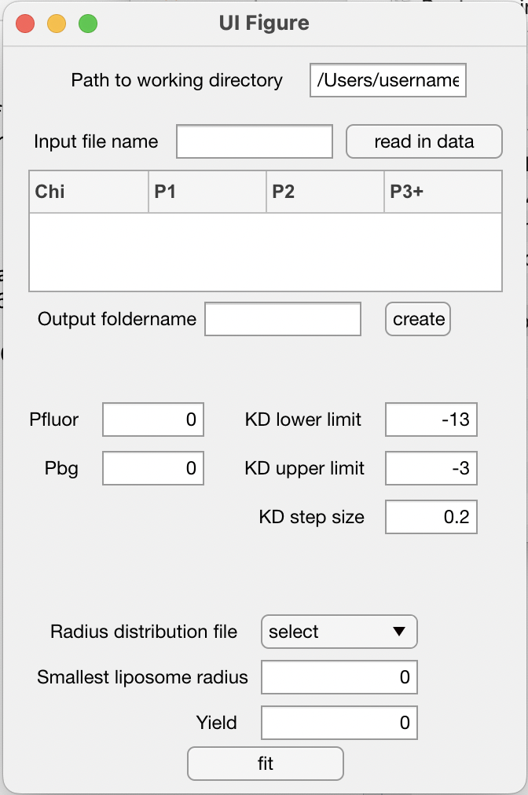
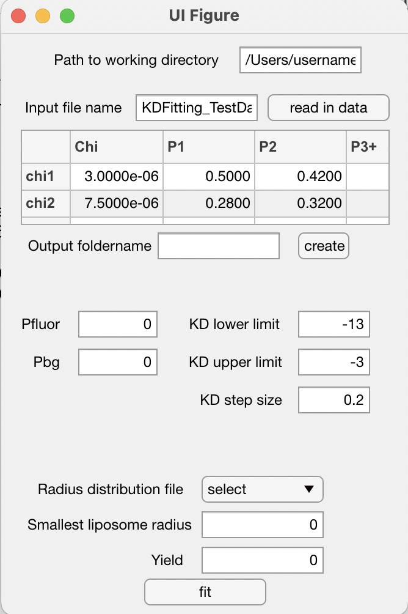
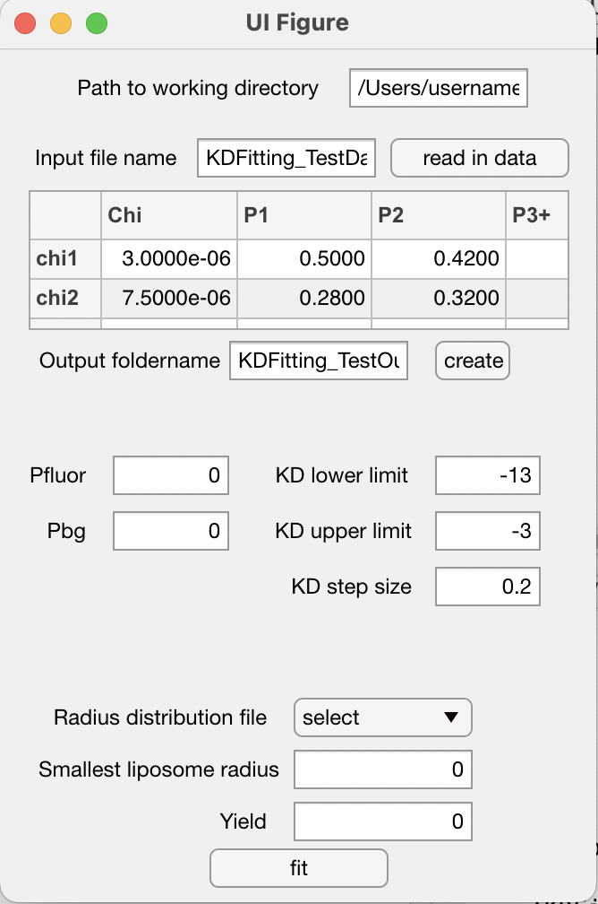
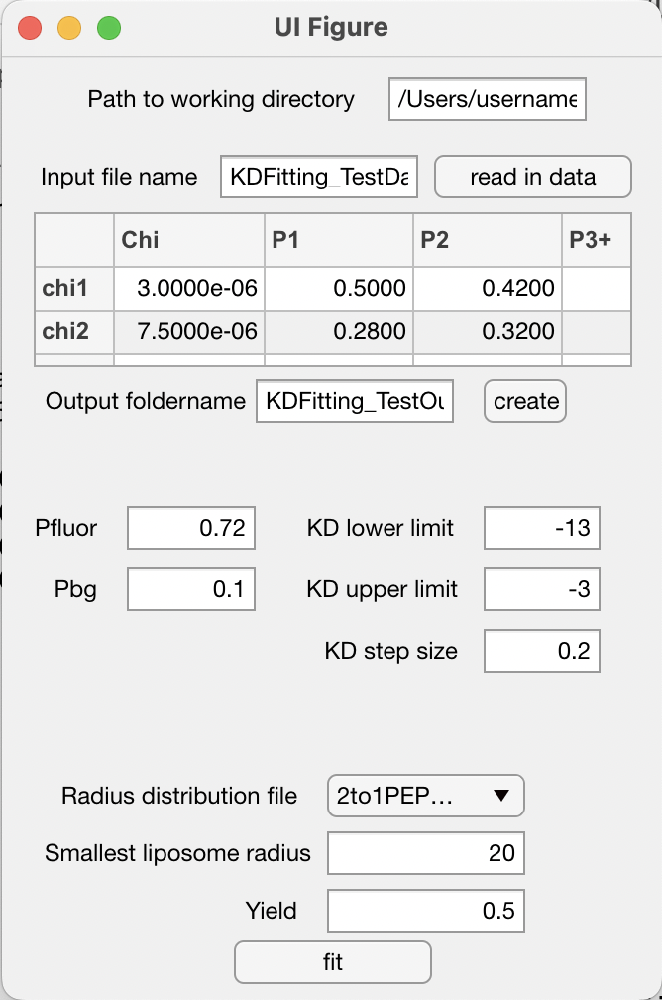

# Description

smPBfit contains two Matlab applications. The first one, named `PfluorPbgfitting.mlapp`, performs an iterative fitting of the experimental dimeric photobleaching probability distribution to an irreversible dimeric control of a membrane protein of interest, while varying labeling parameters, to estimate the labeling yields. The second one, named `KDfitting.mlapp`, uses the average predicted labeling yield over multiple samples in order to estimate the dissociation constant of other reactive dimerization reactions of the membrane protein of interest. smPBfit eliminates the need to quantify fluorophore labeling *a priori* and thus it can be generalized to study other dimerization reactions where an irreversible dimeric control can be prepared. 

# Instructions

### 1 - Download the smPBfit folder and move the folder to desired destination on computer. This folder contains the following files and subfolders:


  * `KDfitting.mlapp`: Matlab application designed to fit a photobleaching distribution to obtain best fits for $K_{D}$
  
  * `KDFitting_TestData.dat`: An example photobleaching distribution data file
  * **KDFitting_TestOutput**: The subfolder that contains files generated when `KDfitting.mlapp` is run using the `KDFitting_TestData.dat` input file
  
  * `PfluorPbgfitting.mlapp`: Matlab application designed to fit a dimer photobleaching distribution in order to obtain best fits for labeling efficiencies $P_{fluor}$ and $P_{bg}$

  * **radii**: The subfolder that contains radii distribution files. The radii distribution is the probability distribution of liposome sizes and is usually measured by an experimental technique such as cryo-EM. 
  
  * `TestInputData.dat`: An example data file of the photobleaching distribution for a dimeric protein
  
  * **TestOutput**: The subfolder that contains files generated when `PfluorPbgfitting.mlapp` is run using the `TestInputfile.dat` input file
  

Note that the Matlab apps were designed in `Matlab2020b` version. Previous versions might not support the applications and different operating systems might need adjustments to the code. Additionally, `Statistics and Machine Learning Toolbox` needs to be installed in order to run the Matlab app.


### 2 - Estimate the labelling efficiencies, $P_{fluor}$ and $P_{bg}$

* Double click `PfluorPbgfitting.mlapp` to open.



* Enter the path for the designated working directory under `Path to working directory`. This should be where the downloaded folder is saved. Example: `/Users/username/Documents/MATLAB/smPBfit/`



* Enter the name of the photobleaching file. This document should entail the mole fraction and the associated $P_1$, $P_2$, $P_{3+}$ and should be in a `.dat` format. Note only add the file name **without** the file extension (`.dat`). Example: `TestInputData.dat` should be entered as `TestInputData`.
This file contains:

```
2E-8	0.60	0.37	0.03
2E-7	0.38	0.39	0.22
2E-6	0.41	0.41	0.18
2E-9	0.47	0.46	0.07
2E-8	0.49	0.47	0.04
2E-7	0.41	0.49	0.10
2E-6	0.41	0.50	0.09
2E-9	0.25	0.46	0.29
2E-8	0.35	0.49	0.16
2E-7	0.30	0.58	0.12
2E-6	0.29	0.46	0.25
2E-9	0.63	0.32	0.05
2E-8	0.63	0.32	0.04
2E-7	0.43	0.42	0.15
2E-6	0.47	0.38	0.15
2E-9	0.51	0.46	0.03
2E-8	0.50	0.45	0.05
2E-7	0.44	0.43	0.13
2E-6	0.45	0.41	0.15
```

Here the columns show the mole fraction (subunit to lipid ratio), $P_1$, $P_2$ and $P_{3+}$ probabilities, respectively. 

Push `read in data` button. The photobleaching data should now be appearing in the table in the app display.




* Create an output folder by entering the desired output folder name under `output foldername` section. When `create` button is pushed, the folder will be created in the current working directory.



* Enter the user-set values for all parameters listed as follows:

    - $P_{fluor}$ lower limit: The lower limit of $P_{fluor}$ to fit the photobleaching data with 
    
    - $P_{fluor}$ higher limit: The upper limit of $P_{fluor}$ to fit the photobleaching data with
    
    - $P_{bg}$ lower limit: The lower limit of $P_{bg}$ to fit the photobleaching data with
    
    - $P_{bg}$ higher limit: The upper limit of $P_{fluor}$ to fit the photobleaching data with. $P_{fluor}$ = $P_{bg}$ + $P_{site}$ Therefore, $P_{fluor}$ should be greater than $P_{bg}$. We suggest that the upper limits for $P_{bg}$ and $P_{fluor}$ should be set to <0.5 and 1, respectively. 
    
    - Radius distribution file: Select one of the files (these are found in the radii folder and they contain the probability distribution of liposome sizes, usually experimentally measured by cryo-EM)
    
    - Smallest liposome radius: If the protein is large, indicate what the smallest liposome size radius is that allows for occupancy of the liposome by two subunits of the protein of interest.
    
    - Yield: The protein to lipid recovery yield after the reconstitution process


	
* Press `Fit`.

#### **Understanding the output files**
This Matlab app will create six output files:
1. `labelingefficiency_output.txt`
2. `heatmap.png`
3. `heatmap_inverse.png`
4. `Pfluor_bootstrapped.png`
5. `Pbg_bootsrapped.png`
6. `SSR_rawdata.dat`


### 3 - Estimate the $K_{D}$

* Open `KDfitting.mlapp` by double-clicking.



* Insert the path to your working directory under Path to working directory. Example: `/Users/username/Documents/MATLAB/TITLE/`



* Insert the name of your photobleaching file. This document should entail the mole fraction and the associated $P_1$, $P_2$, $P_{3+}$ and should be in a .dat format. Note please only add the file name, not the file extension (no .dat)
Example: `KDFitting_TestData.dat` should be entered as
This file contains:

```
3.0E-6	0.50	0.42	0.08
7.5E-6	0.28	0.32	0.40
1.5E-9	0.70	0.26	0.05
7.5E-9	0.72	0.25	0.03
1.5E-8	0.65	0.28	0.07
7.5E-8	0.63	0.28	0.09
1.5E-7	0.55	0.29	0.16
7.5E-7	0.49	0.33	0.19
1.5E-6	0.30	0.40	0.30
3.0E-6	0.35	0.37	0.29
7.5E-6	0.22	0.32	0.46
1.5E-9	0.68	0.27	0.05
7.5E-9	0.73	0.22	0.06
1.5E-8	0.64	0.25	0.11
7.5E-8	0.61	0.29	0.10
1.5E-7	0.47	0.38	0.14
7.5E-7	0.37	0.37	0.26
1.5E-6	0.38	0.41	0.21
3.0E-6	0.32	0.33	0.36
7.5E-6	0.28	0.37	0.35
```

Push `read in data` button. The photobleaching data should now be appearing in the table in the app display.



* Create an output folder: under output folder name give your desired output folder a name and push create to make that folder. A new folder should show up in your working path directory. 



* Indicate your parameters:

    - $P_{fluor}$: $P_{fluor}$ value to fit the photobleaching data with. Determined either experimentally or via PfluorPbgfitting
    - $P_{bg}$: $P_{bg}$ value to fit the photobleaching data with. Determined either experimentally or via $P_{fluor}$$P_{bg}$ fitting (using `PfluorPbgfitting.mlapp`)
    - $K_D$ lower limit: The lower limit of $K_D$ to fit the photobleaching data with
    - $K_D$ upper limit: The upper limit of $K_D$ to fit the photobleaching data with
    - $K_D$ step size: The range of $K_D$ to fit the photobleaching data with
    - Radius distribution file: Select one of the files (these are found in the radii folder and contain the probability distribution of liposome sizes, usually experimentally measured by cryo-EM)
    - Smallest liposome radius: If the protein is large, indicate what the smallest liposome size radius is that allows for occupancy of the liposome by two subunits. 
    - Yield: The protein to lipid recovery yield after the reconstitution process



* Press `Fit`.

#### **Understanding the output files**
`KDfitting.mlapp` will create 3 output files:
1. `KD_output.png`
2. `KD_output.txt`
3. `KD_SSR_rawdata.dat`
